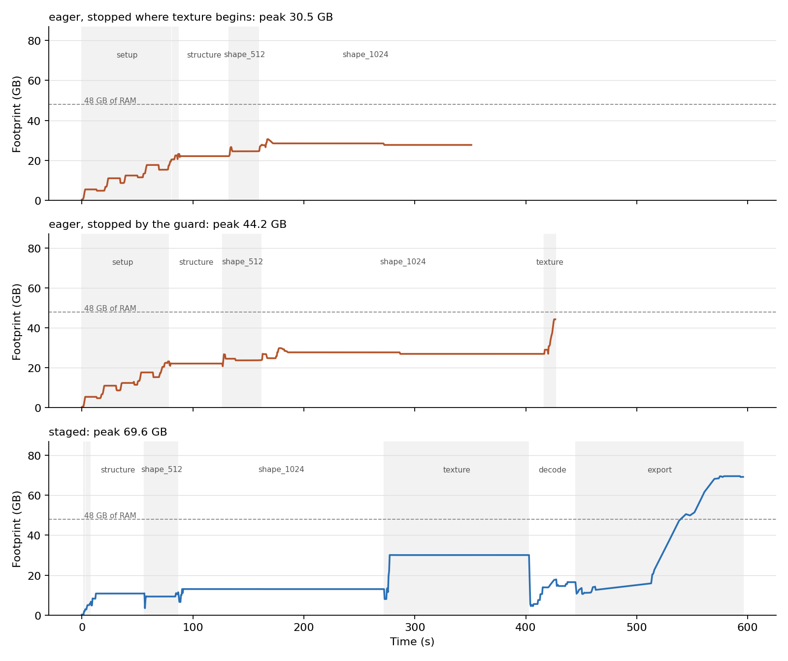

# stageload

Run multi-stage PyTorch pipelines on Apple Silicon with only the current stage's weights in memory.



## Why

On Apple Silicon the CPU and the GPU share one pool of memory. The usual way to fit a big
pipeline, keeping idle models "on the CPU" and moving the active one to the GPU, frees nothing
there: both copies sit in the same RAM. Pixal3D runs in that mode by default (`low_vram` is on
unless its `pipeline.json` turns it off), so a `1024_cascade` run keeps all seven of its models
in memory for the whole run and copies the active one to MPS on top. It also loads the same
DINOv3 backbone four times, once per feature extractor.

stageload loads a model the first time a stage asks for it and releases it in place when the
pipeline moves to a stage that does not need it. Releasing moves the module's tensors to PyTorch's
`meta` device, which frees their storage even while other code still holds a reference to the
module. The design is in [docs/design/2026-10-04-stageload-design.md](docs/design/2026-10-04-stageload-design.md).

## Results

Pixal3D `1024_cascade` on an Apple M5 Pro with 48 GB, one image, seed 7, two runs per mode
([details and traces](bench/results/2026-10-05/README.md)):

| stage | eager, peak footprint | staged, peak footprint |
|---|---|---|
| setup | 20.4 GB | 2.9 GB |
| structure | 22.2 GB | 10.9 GB |
| shape_512 | 26.6 GB | 11.5 GB |
| shape_1024 | 30.5 GB | 13.1 GB |
| texture | stopped by the guard at 44.2 GB, 6 % of memory available | 30.1 GB |
| decode | – | 17.9 to 18.4 GB |
| export | – | 69.6 to 70.2 GB |

- Eager loading did not get through the texture stage on this machine. Within 10 s of entering
  it the footprint rose from 27 to 44 GB, available memory fell to 6 % and swap reached 27 GB,
  12 GB more than when the run started, so the guard stopped it. The other eager numbers come
  from runs stopped where the texture stage begins. Both staged runs finished, in about ten minutes each, of which 24 s went to
  loading models.
- The highest staged footprint is the port's own mesh export, after every weight has been
  released; stageload does not change it.
- Output: the first latent (the sparse structure) is the same bit for bit in every run. From the
  first sparse stage on, Pixal3D-mac does not repeat itself on MPS even with the same seed: two
  eager runs differ by up to 1.77 in the 512 shape latent, and staged runs differ from eager runs
  by 1.24 to 1.86, within the same spread.

## How it works

- `StagedModels` is a dictionary of models that loads each one on first access. `enter(stage)`
  releases every loaded model the stage does not list. Checking `name in models`, `len()` and
  iterating names never load anything.
- Loading a model leaves the CPU, MPS and CUDA random generators where they were. A pipeline
  that seeds once and draws noise stage by stage would otherwise get different noise, and a
  different result, as soon as a model is built in the middle of the run.
- `release(module)` moves every parameter and buffer to `meta`, collects garbage and empties the
  MPS cache. A released module raises `ReleasedModuleError` with its name and the stage that
  released it, instead of PyTorch's error about meta tensors.
- `on_call(obj, method, before=..., after=...)` marks stage boundaries on an existing pipeline
  object, so its own `run()` executes unchanged.
- `share(owner, "from_pretrained")` makes identical loads return one instance for the duration of
  a block; the Pixal3D adapter uses it to give four extractors one DINOv3 backbone.
- `MemoryMeter` writes a JSONL trace: the process footprint (`phys_footprint`, the number
  Activity Monitor shows), swap and `kern.memorystatus_level` every 0.5 s, plus every load,
  release and stage change.

## Pixal3D-mac

Install [Pixal3D-mac](https://github.com/pawel-mazurkiewicz/Pixal3D-mac) with its own README, then
add stageload to the port's environment without touching its packages:

```bash
~/local-llm/Pixal3D-mac/.venv/bin/pip install --no-deps git+https://github.com/nefayran/stageload
stageload-pixal3d photo.png -o photo.glb
```

`--load eager` runs the port's own loading for comparison. Flags, stages and the bench are in
[docs/pixal3d.md](docs/pixal3d.md).

## The guard

`stageload guard` starts one command only when there is room for it, and stops it before swap
runs away. It needs no root, and the only processes it ever stops are the command and its process
group.

```bash
stageload guard --wait-free 40 --swap-budget 8G --busy 'ltx-2-mlx' -- python train.py
```

It waits until `kern.memorystatus_level` is at least `--wait-free` percent and no process has matched
a `--busy` pattern for `--quiet-for` (a minute by default, so the gap between two jobs of a chain
does not count as quiet), then runs the command. It stops the command if swap grows more than
`--swap-budget` over what was used at the start, or if available memory stays under `--kill-free`
(10 %) for two samples. Exit code 3 means the guard stopped the command, 4 means it never found room
to start it; otherwise you get the command's own exit code.

For a safety net across the whole machine, see
[macos-oom-guard](https://github.com/fl4p/macos-oom-guard), a root daemon that kills the largest
process before the kernel panics. The two do different jobs and can run together.

## Use it in your own pipeline

```python
from safetensors.torch import load_file
from stageload import StagedModels

def loader(cls, path):          # cls: one of your nn.Module classes
    def load():
        model = cls()
        model.load_state_dict(load_file(path))
        return model.to("mps").eval()
    return load

models = StagedModels(
    {"encoder": loader(Encoder, "encoder.safetensors"),
     "decoder": loader(Decoder, "decoder.safetensors")},
    stages={"encode": ["encoder"], "decode": ["decoder"]},
)

models.enter("encode")
latent = models["encoder"](image)   # loaded here
models.enter("decode")              # the encoder is released here
mesh = models["decoder"](latent)
models.close()
```

## Limits

- The meter and the guard read macOS counters (`libproc`, `sysctl`). The registry and `release`
  work wherever PyTorch runs.
- One adapter so far: Pixal3D-mac, tested at commit `0be9e69`.
- A staged Pixal3D pipeline serves one image; the command builds a new one per image.
- The meter samples from a thread inside the process. While native code holds the interpreter
  lock it takes no samples, so a short peak inside such a call can be missed.
- Pixal3D-mac does not repeat its sparse stages on MPS with the same seed, so a staged result can
  only be checked against eager within that run-to-run spread.

## License

MIT. Pixal3D and Pixal3D-mac are MIT-licensed as well and are not included here; the adapter
imports the port at run time.
